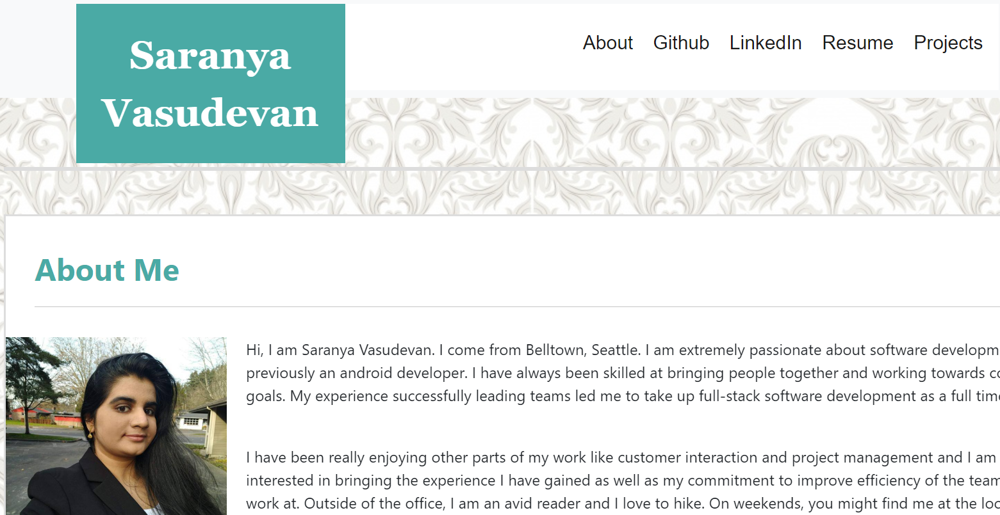
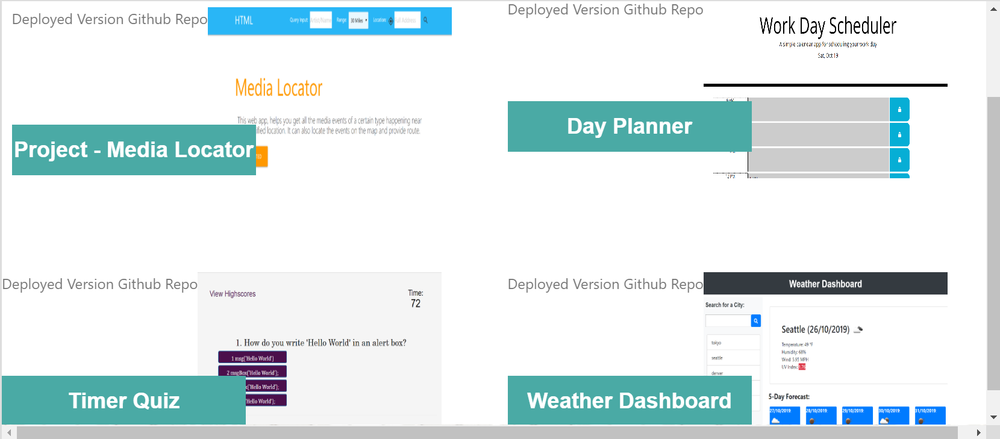

# updated Portfolio
Name:
Updating Portfolio page, along with updating it with LinkedIn, Github, Resume link and link to project and assignments.

Descripton:
This assignment is about updating all professional accounts and creating a portfolio page.

Visuals:

Here are some screenshots:

 

 

Installation:

This webpage is available as my github page whose link is https://saranyav91.github.io/updated_portfolio/

Usage:

This is, as mentioned earlier, a responsive webdesign. So, this webpage can be accessed from different devices of varied resolutions, whithout any issue in the page outlook and navigation.

Support:

Contact me, Saranya Vasudevan at sara.29891@gmail.com